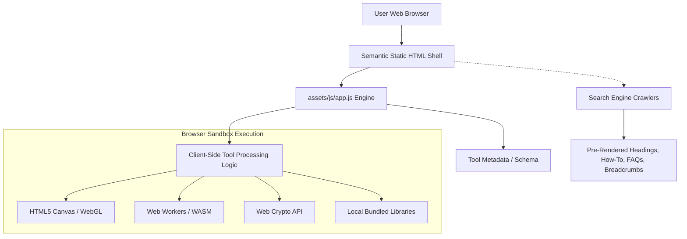

# AllInOneTool — Complete Suite of Client-Side Web Utilities

> **170+ Fast, Secure, 100% Client-Side In-Browser Productivity Tools Across 10 Categories**  
> *Zero Server Uploads • Zero Tracking • Maximum Privacy • Instant Local Execution*

---

## 📖 Table of Contents

1. [Project Overview](#-project-overview)
2. [Key Architecture & Core Principles](#-key-architecture--core-principles)
3. [Directory & File Structure](#-directory--file-structure)
4. [Category & Tool Ecosystem](#-category--tool-ecosystem)
5. [SEO & Discoverability Architecture](#-seo--discoverability-architecture)
   - [Centralized SEO Catalog](#centralized-seo-catalog)
   - [Automated Page Compilers](#automated-page-compilers)
   - [Structured Data (JSON-LD)](#structured-data-json-ld)
   - [Canonical & Meta Specifications](#canonical--meta-specifications)
6. [Local Development & Build Workflow](#-local-development--build-workflow)
7. [Automated Verification & Auditing](#-automated-verification--auditing)
8. [Production Deployment Guidelines](#-production-deployment-guidelines)
9. [Privacy & Security Guarantee](#-privacy--security-guarantee)
10. [Contributing & Code Conventions](#-contributing--code-conventions)

---

## 🌟 Project Overview

**AllInOneTool** (`https://allinonetool.com`) is a comprehensive suite of 170 browser-based productivity utilities. Designed as a unified replacement for fragmented online converters, calculators, and file manipulation utilities, AllInOneTool runs entirely inside the user's web browser tab.

Unlike traditional web utility platforms that upload confidential documents, company spreadsheets, and personal photographs to remote servers for processing, **AllInOneTool operates on a 100% client-side architecture**. Every transformation—from PDF compression and DOCX generation to cryptographic hashing and audio spelling—is executed on your local CPU/GPU using modern web APIs.

### Highlights
- **170 Production-Ready Tools**: Full coverage across Image, PDF, Text, Calculators, Unit Converters, SEO, Developer utilities, Color tools, Passwords, and General utilities.
- **Zero Server Uploads**: Mathematical certainty of confidentiality; files never leave user memory.
- **Sub-Millisecond Processing**: Bypasses network queues and cloud limits; execution speed is bounded only by local device capabilities.
- **Responsive Modern UI**: Built with accessible semantic HTML5, CSS custom properties, system font stacks, and persistent dark/light theme switching.
- **Enterprise-Grade Technical SEO**: 100% crawlable semantic static markup, dedicated category hub pages, automated sitemap, and rich Google-compliant JSON-LD schemas.

---

## 🏗️ Key Architecture & Core Principles



### 1. Pure Vanilla ES6+ & Modular System
- **No Heavy Framework Overhead**: Built with modern vanilla JavaScript (ES modules) rather than heavy framework bundles, ensuring instant First Contentful Paint (FCP) and near-zero Total Blocking Time (TBT).
- **Separation of Concerns**:
  - `tools/*.html`: Pre-rendered semantic static shells containing `<head>` SEO tags, JSON-LD schemas, and crawler-accessible content.
  - `assets/js/data/tools/*.js`: Tool declarative configuration (inputs, options, labels, help text, and SEO metadata).
  - `assets/js/tools/*.js`: Isolated, stateless functional processing modules containing the tool logic.
  - `assets/js/components/*.js`: Reusable UI modules (Header, Footer, Sidebar, FAQ Accordion, Related Tools, Search Box, Tool Card).

### 2. Dual-Layer Static & Dynamic Rendering
To ensure both top-tier search engine indexing and seamless single-page application hydration:
- Crawlers receive complete semantic HTML with unique `<title>`, `<meta name="description">`, `<h1>`, detailed step-by-step instructions, benefits lists, and interactive FAQ accordions.
- On browser load, `assets/js/app.js` initializes the interactive `#tool-workspace` and binds local file listeners, canvas renderers, and event handlers.

---

## 📁 Directory & File Structure

```text
AllInOneTool/
├── index.html                   # Primary portal homepage
├── 404.html                     # Custom user-friendly 404 page with hub navigation
├── about.html                   # About AllInOneTool & privacy charter
├── contact.html                 # Contact & user feedback page
├── privacy-policy.html          # Comprehensive zero-upload privacy policy
├── terms.html                   # Terms of service and usage conditions
├── disclaimer.html              # Informational disclaimer & liability notice
├── robots.txt                   # Search crawler directives & sitemap reference
├── sitemap.xml                  # Complete sitemap of all 186 indexable URLs
├── SEO_AUDIT.md                 # Automated audit report verifying 100% compliance
│
├── config/
│   └── seo.js                   # Centralized sitewide SEO configuration & category taxonomy
│
├── data/
│   └── seo-catalog.json         # Complete JSON export of all 170 tool SEO profiles
│
├── categories/                  # Dedicated Category Hub Pages (10 hubs)
│   ├── image-tools.html
│   ├── pdf-tools.html
│   ├── text-tools.html
│   ├── calculators.html
│   ├── converters.html
│   ├── seo-tools.html
│   ├── developer-tools.html
│   ├── color-tools.html
│   ├── password-tools.html
│   └── miscellaneous-tools.html
│
├── tools/                       # 170 Dedicated Tool Pages (Pre-rendered semantic HTML)
│   ├── image-compressor.html
│   ├── pdf-to-word.html
│   ├── compound-interest-calculator.html
│   └── ... (170 total tool pages)
│
├── assets/
│   ├── css/                     # Global stylesheet architecture
│   │   ├── variables.css        # CSS tokens (colors, light/dark themes, spacing)
│   │   ├── base.css             # CSS reset and base typography
│   │   ├── layout.css           # Grid systems and responsive containers
│   │   ├── components.css       # Buttons, cards, modals, search inputs
│   │   └── tool.css             # Tool-specific work areas, dropzones, tables
│   │
│   ├── js/
│   │   ├── app.js               # Application coordinator and DOM hydrator
│   │   ├── theme.js             # Theme controller (dark/light/system preference)
│   │   ├── constants/           # Site constants (domain, brand, social handles)
│   │   ├── components/          # Header, footer, sidebar, breadcrumbs, faqs
│   │   ├── data/                # Tool configurations & tools-summary index
│   │   ├── tools/               # 170 Functional tool processing engines
│   │   └── vendor/              # Bundled local libraries (pdf-lib, docx, jszip, etc.)
│   │
│   └── images/                  # Favicons, logos, and OpenGraph social banner
│
└── scripts/                     # Build & Maintenance Automation
    ├── build-seo-catalog.js     # Compiles raw registry into structured SEO metadata
    ├── seo-catalog.js           # Centralized CommonJS module with full SEO profiles
    ├── generate-project.js      # Compiles 170 static tool pages with full SEO markup
    ├── generate-categories.js   # Compiles 10 category hub pages
    ├── generate-sitemap.js      # Generates standard sitemap.xml
    └── audit-seo.js             # Audits titles, descriptions, H1s, canonicals & links
```

---

## 🗂️ Category & Tool Ecosystem

The platform contains **170 tools** organized across 10 core categories:

| Category | Slug | Count | Primary Focus |
| :--- | :--- | :---: | :--- |
| **Image Tools** | `image-tools` | **30** | Compression, format conversion (JPG/PNG/WebP), cropping, resizing, meme generation |
| **PDF Tools** | `pdf-tools` | **20** | Merging, splitting, compressing, unlocking, Word/DOCX extraction, PDF creation |
| **Text Tools** | `text-tools` | **24** | Case conversion, markdown/HTML transformation, obfuscation, ciphers, diff checkers |
| **Calculators** | `calculators` | **27** | Financial (EMI, Compound Interest), Health (BMI/BMR), Date/Time, GPA, Academic |
| **Converters** | `converters` | **21** | Unit conversion (Length, Mass, Speed, Temperature), Base systems, Data storage |
| **SEO Tools** | `seo-tools` | **11** | Meta tag generation, OpenGraph preview, keyword density, robots.txt analyzer |
| **Developer Tools**| `developer-tools`| **19** | JSON/XML formatters, Base64 encode/decode, RegEx tester, JWT decoder, CSS minifiers |
| **Color Tools** | `color-tools` | **5** | Palette generator, HEX/RGB/HSL conversion, contrast checker, color harmony |
| **Password Tools** | `password-tools` | **5** | Password generator, entropy checker, hash verifier, passphrase creator |
| **Miscellaneous** | `miscellaneous-tools` | **8** | NATO audio speller, barcode generator, stopwatch, coin flipper, QR codes |
| **Total** | | **170** | |

---

## 🔍 SEO & Discoverability Architecture

### Centralized SEO Catalog
Every tool in AllInOneTool possesses a structured SEO profile housed within [`scripts/seo-catalog.js`](file:///Users/takrahul/Documents/AllInOneTool/scripts/seo-catalog.js) and mirrored in [`data/seo-catalog.json`](file:///Users/takrahul/Documents/AllInOneTool/data/seo-catalog.json):
- **Unique Semantic Title**: Action-oriented, including primary keyword and USP (`{Tool Name} – {Action & Keywords} | AllInOneTool`).
- **Meta Description**: 140–160 characters describing inputs, utility, and client-side privacy guarantee.
- **Search Intent Analysis**: Categorized by Informational, Commercial, or Navigational intent.
- **Structured Steps (`howToUse`)**: 4 concise instructions for crawlers and users.
- **Benefits & Features**: 4 distinct value propositions and 4 capabilities.
- **Frequently Asked Questions (`faqs`)**: Curated question-and-answer pairs targeting long-tail queries.
- **Curated Related Tools (`relatedTools`)**: Contextually linked utilities to form dense internal link hubs.

### Automated Page Compilers
- **Tool Pages (`scripts/generate-project.js`)**: Generates pre-rendered HTML for all 170 tools with canonical links (`https://allinonetool.com/tools/[slug].html`), robots directives, OpenGraph/Twitter cards, and semantic fallback markup.
- **Category Hubs (`scripts/generate-categories.js`)**: Compiles 10 hub pages featuring tool cards, category descriptions, category FAQs, and cross-category navigation.
- **Sitemap Generator (`scripts/generate-sitemap.js`)**: Generates `sitemap.xml` with priority hierarchy and ISO lastmod dates across all 186 indexable URLs.

### Structured Data (JSON-LD)
All pages include Google Rich Snippet-compatible JSON-LD markup:
- **`WebSite` & `Organization`**: Canonical identity, sitewide logo, and search box metadata on the root portal.
- **`BreadcrumbList`**: Full hierarchical path on every category and tool page (`Home > Category > Tool`).
- **`WebApplication`**: Declares application category, operating system (`"All"`), browser requirement, and free access model (`$0.00 USD`).
- **`FAQPage`**: Accordion FAQs formatted as `Question` and `Answer` entities.
- **`CollectionPage`**: Comprehensive directory markup on category hubs.

---

## 💻 Local Development & Build Workflow

### Prerequisites
- [Node.js](https://nodejs.org/) (v18 or higher recommended)
- Python 3 (optional, for lightweight local HTTP server)

### 1. Launching Local Server
Due to modern browser ES module security restrictions (`file://` protocol restricts ES modules and Web Workers), run the site through a local HTTP server:

```bash
# Using Python 3:
python3 -m http.server 3000

# Or using Node npx:
npx serve -p 3000
```
Open `http://localhost:3000` in your web browser.

### 2. Regenerating Pages and Sitemaps
If you update tool configurations or SEO metadata:

```bash
# Step 1: Update or regenerate the SEO catalog (if tool definitions changed)
node scripts/build-seo-catalog.js

# Step 2: Compile all 170 static tool pages
node scripts/generate-project.js

# Step 3: Compile the 10 category hub pages
node scripts/generate-categories.js

# Step 4: Re-build sitemap.xml
node scripts/generate-sitemap.js

# Step 5: Run the automated technical SEO audit
node scripts/audit-seo.js
```

---

## 🧪 Automated Verification & Auditing

The repository includes a comprehensive SEO and link integrity verification script:

```bash
node scripts/audit-seo.js
```

The script verifies:
1. **Title & Description Completeness**: Ensures every page has a unique title and meta description.
2. **Duplicate Detection**: Confirms 0 duplicate titles and 0 duplicate meta descriptions across all 187 pages.
3. **Canonical Verification**: Confirms all canonical tags strictly point to `https://allinonetool.com`.
4. **Social Sharing Tags**: Validates presence of OpenGraph and Twitter card tags.
5. **Heading Hierarchy**: Ensures exactly one `<h1>` per page.
6. **Structured Data Validation**: Validates JSON syntax of all embedded JSON-LD scripts.
7. **Link Integrity**: Audits all internal `href` targets against actual files on disk (0 broken links).

Audit reports are automatically saved to [`SEO_AUDIT.md`](file:///Users/takrahul/Documents/AllInOneTool/SEO_AUDIT.md).

---

## 🚀 Production Deployment Guidelines

AllInOneTool is designed for serverless, zero-maintenance static hosting. It can be deployed directly to:
- **Cloudflare Pages** (Recommended: global CDN edge caching, automatic Brotli compression, free SSL)
- **Netlify**
- **Vercel**
- **GitHub Pages**
- **AWS S3 + CloudFront**

### Recommended Server Header Directives

For optimal caching and security, configure your web server or edge CDN with the following headers:

```nginx
# Security Headers
add_header X-Content-Type-Options "nosniff" always;
add_header X-Frame-Options "SAMEORIGIN" always;
add_header Referrer-Policy "strict-origin-when-cross-origin" always;
add_header Content-Security-Policy "default-src 'self'; script-src 'self' 'unsafe-inline'; style-src 'self' 'unsafe-inline'; img-src 'self' data: blob:; font-src 'self'; connect-src 'self' blob:; worker-src 'self' blob:;" always;

# Static Assets Caching (CSS, JS, Fonts, Images)
location ~* \.(css|js|png|jpg|jpeg|gif|ico|svg|woff2)$ {
    expires 1y;
    add_header Cache-Control "public, max-age=31536000, immutable";
}

# HTML Pages Caching
location ~* \.html$ {
    expires 1h;
    add_header Cache-Control "public, max-age=3600, must-revalidate";
}
```

---

## 🔒 Privacy & Security Guarantee

AllInOneTool operates on a strict **Zero-Data Egress** architecture:

1. **No Backend Upload Endpoints**: There are no file upload APIs, cloud storage buckets, or remote analysis services connected to processing tools.
2. **Local Memory Allocation**: Files loaded into drop zones are accessed via `FileReader` or `URL.createObjectURL(file)` directly in browser RAM.
3. **No Third-Party Analytics / Tracking**: No behavioral tracking scripts or third-party cookies invade user privacy.
4. **Compliant by Design**: Fully compliant with GDPR, CCPA, and enterprise confidentiality policies because data is never transferred.

---

## 🤝 Contributing & Code Conventions

- **Preserve Tool Logic**: Never alter calculation formulas, image transforms, or canvas pipelines without creating dedicated unit verification scripts.
- **Maintain SEO Uniqueness**: When adding tools, register them in `config/seo.js` and `scripts/seo-catalog.js` ensuring unique titles and descriptions.
- **Keep Vanilla**: Avoid introducing external heavy runtime frameworks. Utilize modern standard Web APIs (Streams, Workers, Canvas, Crypto).

---

**Built with pride for high-performance, private, client-side web computing.**  
*© AllInOneTool. All rights reserved.*
